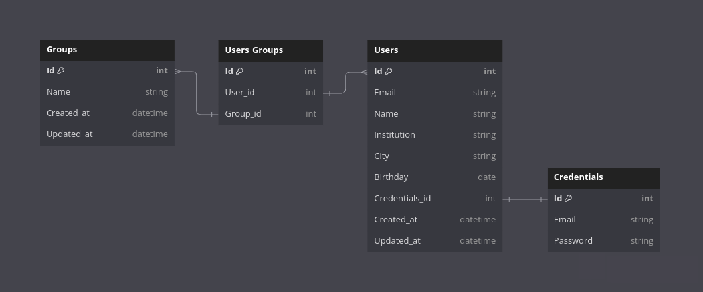

# User Core
This microservice is responsible for managing users. It provides the following functionalities:
- Create users
- Consult users

## How to run
To run this microservice, you need to have the following tools installed:
- [Docker](https://www.docker.com/)
- [Docker Compose](https://docs.docker.com/compose/) (optional)

## API
This microservice provides the following endpoints:
- `POST /api/user`: Create a new user
- `GET /api/user/:id`: Get a user by id
- `GET /api/email?email`: Get a user by email

## Database
This microservice uses a PostgreSQL database to store users. This is an image of the database schema:

